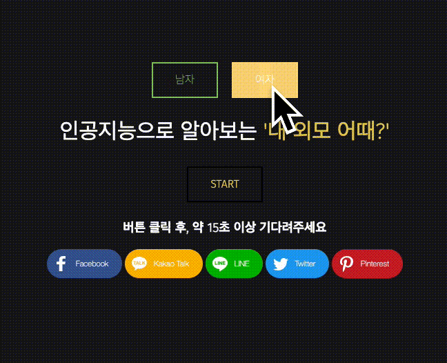

# HowMyFace '내 외모 어때?'

## 인공지능이 알려주는 '내 외모 어때?'

### 	Version Update Record

* 2개 프로젝트 병합 & Entire Code Update & Web 배포 (21.09.22.)
* myfaceobba 최초 완성 및 Web / App 배포 (20.07.29.)
* howaboutmyface 최초 완성 및 Web / App 배포 (21.05.18.)


## 설명



재미로 보는 나의 외모 판별기 ! <br>인공지능으로 남자, 여자 외모를 학습시켰습니다.<br><br>

자신이 잘 생겼는지, 못 생겼는지 궁금하신가요?<br>

사진을 올려보세요. 인공지능이 알려줄거에요.<br>

웹: https://howmyface.netlify.app/ <br>

어플리케이션(안드로이드): 비활성화


## 1. 프로젝트 종류 - Solo

- 팀원 : Gkuer


## 2. 프로젝트 구조


## 2.1 Main


* 남자 / 여자 부분으로 나누어 사이트 이중화

* START 및 addthis로 소셜기능 추가

* Google Teachable Machine 이용하여 모델구축 간소화

* index.html / index2.html 등 기본 템플릿으로 Netlify 무료 배포 가능

* 간략한 파일구조

  * ```
    GKUER1,2-HOWMYFACE
    > my_model
    > my_model2
    > README.assets
      .gitignore
      index.html
      index2.html
      style.css
      README.md
      requirements.txt
    ```

    

## 2.2 Man Version


* 잘생겼어요 / 그냥그래요 / 못생겼어요 - 3개 모델 학습
* 남자 버전은 실시간 카메라로 촬영할 수 있도록 설계
* Google Teachable Machine 이용 부분

```html
<!-- <div>Teachable Machine Image Model</div> -->
<button type="button" onclick="init()" class="btn btn-outline-secondary" style="background: none; border: 2px solid; font: inherit; line-height: 1; margin: 0.5em; padding: 1em 2em;"> <code> START </code> </button>
<h3>버튼 클릭 후, 약 15초 이상 기다려주세요
    
<!-- <button type="button" onclick="init()">Start</button> -->
<div id="webcam-container"></div>
<div id="label-container"></div>
<script src="https://cdn.jsdelivr.net/npm/@tensorflow/tfjs@1.3.1/dist/tf.min.js"></script>
<script src="https://cdn.jsdelivr.net/npm/@teachablemachine/image@0.8/dist/teachablemachine-image.min.js"></script>
<script type="text/javascript">
    // More API functions here:
    // https://github.com/googlecreativelab/teachablemachine-community/tree/master/libraries/image

    // the link to your model provided by Teachable Machine export panel
    const URL = "./my_model/";

    let model, webcam, labelContainer, maxPredictions;

    // Load the image model and setup the webcam
    async function init() {
        const modelURL = URL + "model.json";
        const metadataURL = URL + "metadata.json";

        // load the model and metadata
        // Refer to tmImage.loadFromFiles() in the API to support files from a file picker
        // or files from your local hard drive
        // Note: the pose library adds "tmImage" object to your window (window.tmImage)
        model = await tmImage.load(modelURL, metadataURL);
        maxPredictions = model.getTotalClasses();

        // Convenience function to setup a webcam
        const flip = true; // whether to flip the webcam
        webcam = new tmImage.Webcam(210, 210, flip); // width, height, flip
        await webcam.setup(); // request access to the webcam
        await webcam.play();
        window.requestAnimationFrame(loop);

        // append elements to the DOM
        document.getElementById("webcam-container").appendChild(webcam.canvas);
        labelContainer = document.getElementById("label-container");
        for (let i = 0; i < maxPredictions; i++) { // and class labels
            labelContainer.appendChild(document.createElement("div"));
        }
    }

    async function loop() {
        webcam.update(); // update the webcam frame
        await predict();
        window.requestAnimationFrame(loop);
    }

    // run the webcam image through the image model
    async function predict() {
        // predict can take in an image, video or canvas html element
        const prediction = await model.predict(webcam.canvas);
        if(prediction[0].className == "handsome" && prediction[0].probability.toFixed(2) == 1.00){labelContainer.childNodes[0].innerHTML = "잘생겼어요"
        } else if(prediction[1].className == "ugly" && prediction[1].probability.toFixed(2) == 1.00){labelContainer.childNodes[0].innerHTML = "못생겼어요"
        } else {labelContainer.childNodes[0].innerHTML = "그냥그래요"}
        // for (let i = 0; i < maxPredictions; i++) {
        //     const classPrediction =
        //         prediction[i].className + ": " + prediction[i].probability.toFixed(2);
        //     labelContainer.childNodes[i].innerHTML = classPrediction;
        // }
    }
</script>
</div>
```


## 2.3 Woman Version


* 예쁘다 / 별로야 - 지도학습 출력결과 퍼센트를 소수점 둘째자리까지 그대로 출력
* 업로드한 사진을 클릭하면 다른 사진을 선택할 수 있도록 설계
* 업로드 전 / 재업로드 대기시 화면


<br>

* Model 사용 부분 (Google Teachable Machine 이용)

```html
<!-- <div>Teachable Machine Image Model</div> -->
<script class="jsbin" src="https://ajax.googleapis.com/ajax/libs/jquery/1/jquery.min.js"></script>
<div class="file-upload">
  
  <div class="image-upload-wrap">
    <input class="file-upload-input" type='file' onchange="readURL(this);" accept="image/*" />
    <div class="drag-text">
      <h3><br><br>내 사진 업로드!</h3>
    </div>
  </div>
  <div class="file-upload-content">
    
    
    <div class="image-title-wrap">
      <button type="button" onclick="removeUpload()" class="remove-image">사진 업로드 후 15초 이상 기다려주세요!</span></button>
    </div>
  </div>
</div>
<div id="webcam-container"></div>
<script src="https://cdn.jsdelivr.net/npm/@tensorflow/tfjs@1.3.1/dist/tf.min.js"></script>
<script src="https://cdn.jsdelivr.net/npm/@teachablemachine/image@0.8/dist/teachablemachine-image.min.js"></script>
<script type="text/javascript">
    // More API functions here:
    // https://github.com/googlecreativelab/teachablemachine-community/tree/master/libraries/image

    // the link to your model provided by Teachable Machine export panel
    const URL = "./my_model2/";

    let model, webcam, labelContainer, maxPredictions;

    // Load the image model and setup the webcam
    async function init() {
        const modelURL = URL + "model.json";
        const metadataURL = URL + "metadata.json";

        // load the model and metadata
        // Refer to tmImage.loadFromFiles() in the API to support files from a file picker
        // or files from your local hard drive
        // Note: the pose library adds "tmImage" object to your window (window.tmImage)
        model = await tmImage.load(modelURL, metadataURL);
        maxPredictions = model.getTotalClasses();

      
        labelContainer = document.getElementById("label-container");
        for (let i = 0; i < maxPredictions; i++) { // and class labels
            labelContainer.appendChild(document.createElement("div"));
        }
    }


    // run the webcam image through the image model
    async function predict() {
        // predict can take in an image, video or canvas html element
        var image = document.getElementById("face-image")
        const prediction = await model.predict(image, false);

        for (let i = 0; i < maxPredictions; i++) {
            const classPrediction =
                prediction[i].className + ": " + prediction[i].probability.toFixed(2);
            labelContainer.childNodes[i].innerHTML = classPrediction;
        }
    }
</script>
<script>
  function readURL(input) {
  if (input.files && input.files[0]) {

    var reader = new FileReader();

    reader.onload = function(e) {
      $('.image-upload-wrap').hide();

      $('.file-upload-image').attr('src', e.target.result);
      $('.file-upload-content').show();

      $('.image-title').html(input.files[0].name);
    };

    reader.readAsDataURL(input.files[0]);
    init().then(()=>{
      console.log("hello");
      predict();
    });

  } else {
    removeUpload();
  }
}

function removeUpload() {
  $('.file-upload-input').replaceWith($('.file-upload-input').clone());
  $('.file-upload-content').hide();
  $('.image-upload-wrap').show();
}
$('.image-upload-wrap').bind('dragover', function () {
		$('.image-upload-wrap').addClass('image-dropping');
	});
	$('.image-upload-wrap').bind('dragleave', function () {
		$('.image-upload-wrap').removeClass('image-dropping');
});

</script>

<p><a>
  Answer : 
  <h3><div id= "label-container"></div></h3>
</a></p>
```


기존: 코딩에 처음 들어서고 처음 해봤던 프로젝트를 보기 좋게 가공할 필요성이 느껴짐

업데이트: 지도학습 및 모델 부분은 추후 새로운 프로젝트에서 진행하고, 과거에 했던 모델을 이용하여 재가공함

​				Gkuer2-MyFaceObba Repository는 삭제


<h3 style = "text-align:center;"> gkuer1 + gkuer2

